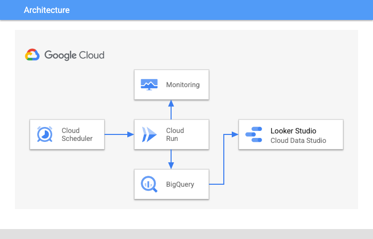

# Right-size your GKE workloads at scale

## Description

This tutorial shows you how to right-size your Google Kubernetes Engine (GKE) applications by exporting Vertical Pod Autoscaler (VPA) recommendations from Cloud Monitoring into BigQuery without creating VPA objects for Deployment workloads.

In BigQuery, you can use SQL queries to view and analyze:

- Top over-provisioned GKE workloads across all of your projects.
- Top under-provisioned GKE workloads across all your projects.
- GKE workloads at risk of reliability or performance issues.


### Use case
Under-provisioning can starve your containers of the necessary resources to run your applications, making them slow and unreliable. Over-provisioning doesn't impact the performance of your applications but might increase your monthly bill.

The following table describes the implications of under-provisioning and over-provisioning CPU and memory:

| Resource | Provisioning status | Risk        | Explanation                                                              |
|----------|---------------------|-------------|--------------------------------------------------------------------------|
| CPU      | Over                | Cost        | Increases the cost of your workloads by reserving unnecessary resources. |
|          | Under               | Performance | Can cause workloads to slow down or become unresponsive.                 |
|          | Not set             | Reliability | CPU can be throttled to 0 causing your workloads to become unresponsive. |
| Memory   | Over                | Cost        | Increases the cost of your workloads by reserving unnecessary resources. |
|          | Under               | Reliability | Can cause applications to terminate with an out of memory (OOM) error.   |
|          | Not set             | Reliability | kubelet can stop your Pods, at any time, and mark them as failed.        |


## Architecture
Please find below a reference architecture.



## Deploy

1. [Create a monitoring project to see GKE VPA recommendations across clusters and projects](https://cloud.google.com/monitoring/settings/multiple-projects)

2. Click on Open in Google Cloud Shell button below.
<p>
<a href="https://ssh.cloud.google.com/cloudshell/editor?cloudshell_git_repo=https://github.com/GoogleCloudPlatform/click-to-deploy-solutions&cloudshell_workspace=gke-vpa-recommendations" target="_new">
    
</a>
</p>

3. Run the `cloudbuild.sh` script and follow the instructions
```
sh cloudbuild.sh
```

Once it is finished, you can go to [Cloud Composer](https://console.cloud.google.com/composer/environments) to see the dags' results and explore the Cloud Composers's functionalities.

## Testing

Run the Cloud Run > Jobs > Execute
or run by manually executing the Cloud Scheduler > Force Run


In the Cloud Shell terminal, verify that GKE metric data exists in BigQuery
```
bq query \
    --use_legacy_sql=false \
    "SELECT DISTINCT metric_name FROM PROJECT_ID.metric_export.mql_metrics ORDER BY metric_name"
```

Replace ```PROJECT_ID``` with your project ID.

The output should show the following metrics

- container_count                             
- cpu_limit_cores                             
- cpu_request_95th_percentile_recommendations 
- cpu_request_max_recommendations             
- cpu_requested_cores                                                          
- memory_limit_bytes                          
- memory_request_recommendations              
- memory_requested_bytes                      


If output does not match, wait five minutes and then run application

Once all system metrics are loaded, check the uploaded data on BigQuery > metric_exporter > vpa_container_recommendations table.

```sql
SELECT * FROM `PROJECT_ID.metric_export.vpa_container_recommendations` where latest = TRUE
```
Replace ```PROJECT_ID``` with your project ID.

The ```recommendation_date``` is the date the function created the recommendation. All workloads might not be visible on the recommendation table after the first run. For production environments, wait 24 hours for non-HPA workloads to appear in the VPA recommendation table.

Warning: Failing or restarting workloads cause recommendations to be incorrect. Ensure workloads are healthy before updating resource configurations.

[Visualize recommendations in Looker Studio](https://cloud.google.com/kubernetes-engine/docs/tutorials/right-size-workloads-at-scale#visualize)


## Destroy

1. Click on Open in Google Cloud Shell button below.
<a href="https://ssh.cloud.google.com/cloudshell/editor?cloudshell_git_repo=https://github.com/GoogleCloudPlatform/click-to-deploy-solutions&cloudshell_workspace=gke-vpa-recommendations" target="_new">
    
</a>

2. Run the `cloudbuild.sh` script with `destroy` argument
```
sh cloudbuild.sh destroy
```